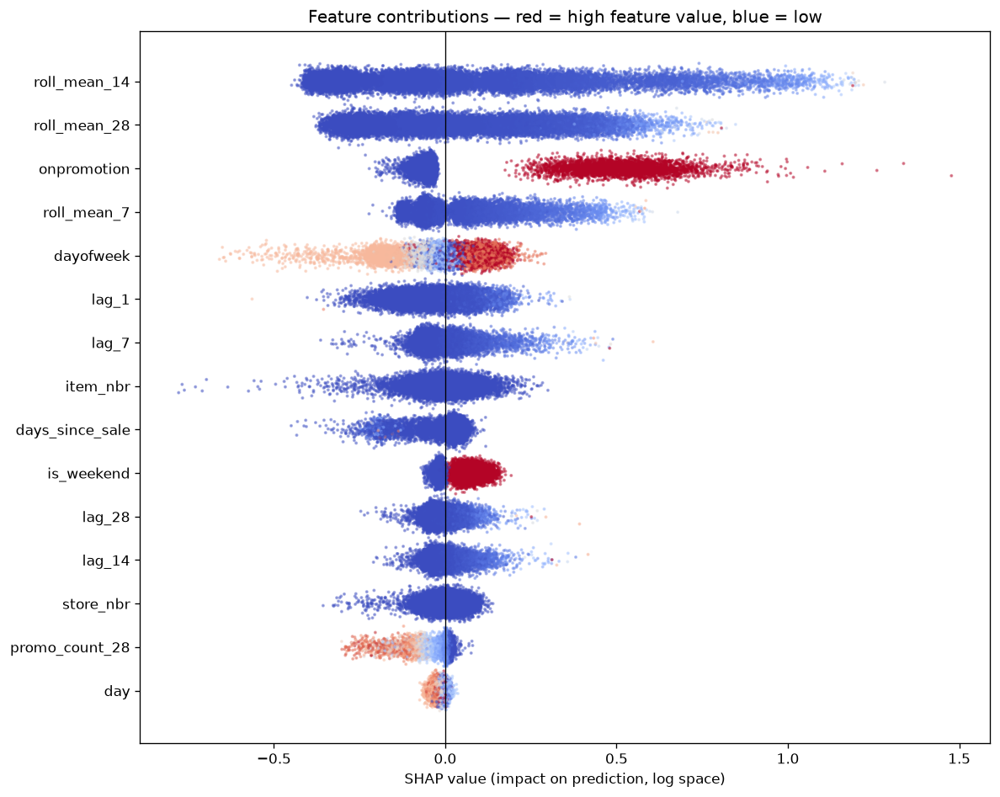

# Perishable Demand Forecasting

**Cutting forecast-related costs by 38% on fresh protein categories — by optimizing for spoilage cost rather than forecast accuracy.**

**[→ Try the live demo](https://perishable-demand-forecasting-yqyz9zztek2qmerncudrxf.streamlit.app/)**

End-to-end demand forecasting for perishable protein (meats, poultry, deli, prepared foods, seafood) across 54 supermarkets, built on the Corporación Favorita retail dataset. 125M raw transaction rows processed on an 8GB laptop.

---

## Headline results

| | Baseline | Model | Improvement |
|---|---|---|---|
| **Forecast-related cost** (16-day test period) | $1,973,964 | **$1,218,649** | **38.3% reduction** |
| WAPE | 48.60 | 41.70 | 14.2% reduction |
| MAE | 3.92 | 3.36 | 14.3% reduction |
| RMSE | 11.42 | 9.14 | 20.0% reduction |

Baseline is a 7-day moving average — the strongest of four naive methods tested. All figures are on a held-out test set touched exactly once, at the end.

Cost reduction holds between **24% and 38%** across nine price/margin scenarios.

---

## The central finding

**For perishable goods, the most accurate forecast is not the cheapest one.**

Forecast errors are asymmetric. Over-forecast and unsold protein spoils — you lose the full cost of goods. Under-forecast and you lose only the margin on a sale you couldn't make. Here that ratio is 3:1.

Standard metrics (MAE, RMSE, WAPE) treat both directions identically. A cost function doesn't.

Scaling forecasts to 80% of the model's output made accuracy **worse** and costs **lower**:

| Scaling factor | WAPE | Cost |
|---|---|---|
| 1.05 | **40.5** ← most accurate | $1,442,055 ← most expensive |
| 1.00 | 40.9 | $1,370,613 |
| **0.80** | 46.1 | **$1,236,945** ← cheapest |
| 0.70 | 50.7 | $1,249,361 |

The metric you optimize and the objective you care about are not the same thing.

---

## Approach

```
125M rows (4.7 GB CSV)
  ↓  DuckDB out-of-core extraction — 5 protein families
9.3M rows
  ↓  date restriction, dtype optimization (745 MB → 187 MB)
5.9M rows
  ↓  grid reconstruction — recovering 1.8M implicit zero-demand days
7.7M rows
  ↓  feature engineering — lags, rolling windows, calendar, promotions, intermittency
7.5M rows × 45 columns
  ↓  time-based split · LightGBM · asymmetric cost optimization
38.3% cost reduction
```

### Key decisions

**Out-of-core processing.** The raw file is 4.7 GB against 8 GB of RAM. DuckDB queries the CSV on disk and returns only matching rows, so exploratory analysis ran across all 125M rows without loading them into memory.

**Grid reconstruction.** The dataset only records days where a sale occurred — 23% of the true daily series was implicitly missing. Left uncorrected, the model would have over-forecast poultry by 36% (16.70 units/day predicted against a true mean of 12.25). The grid was rebuilt *bounded per store-item pair* by first and last observed sale, avoiding 5.8M rows of fabricated history for products a store never carried or had discontinued.

**Leakage prevention.** Every lag and rolling feature is computed on a series shifted by one day within each store-item group, so a 7-day rolling mean for day T covers T−7 through T−1. Validated by confirming `lag_1` had exactly 10,009 nulls — one per store-item pair.

**Time-based validation.** Train on the past, validate on the future, never overlap. A random split would leak future information and produce excellent validation scores with no production value.

---

## What the model learned

Three rolling means account for **80% of total gain** — demand is largely a function of recent demand.

Two importance measures disagreed usefully: `onpromotion` ranked 9th by training gain but **3rd by SHAP**. Promotions affect few rows, so their aggregate training contribution is modest — but when one occurs it moves the prediction substantially. Relying on gain alone would have underrated a key feature.



---

## Serving

Two paths, deliberately:

| Path | Implementation | Reflects |
|---|---|---|
| **Real-time inference** | `app/main.py` — FastAPI, containerized with Docker | On-demand prediction with automatic request validation and interactive API docs |
| **Batch precomputed** | `scripts_precompute.py` → Streamlit demo | How demand forecasting actually runs in production |

A real retailer runs this as a **scheduled batch job** — forecast everything nightly, serve from a table. A live REST API is arguably the less realistic architecture for this use case. The API demonstrates real-time serving capability; the batch path reflects the production pattern.

Run the API locally:
```bash
docker build -t perishable-forecast .
docker run -p 8000:8000 perishable-forecast
# Interactive docs at http://localhost:8000/docs
```

---

## Negative results

Reported because they were tested, not because they worked.

**Holiday proximity features added almost nothing.** The hypothesis was a pre-holiday stock-up ramp for fresh protein. Marginal analysis showed no ramp, and all nine holiday features combined contributed 0.29% of model gain. They were retained only because they reduced RMSE by 5% — helping avoid catastrophic misses rather than improving typical-day accuracy.

**`is_workday_makeup` was never used in a single split.** Built, tested, contributed exactly zero.

**The earthquake effect was invisible in aggregate.** The April 2016 Manabi earthquake showed −2.3% nationally, but **+18.9% in the affected province** — three of 54 stores. Only visible by checking the subgroup.

---

## Limitations

- **The model is undertrained** — training did not trigger early stopping at 400 rounds; validation RMSE was still improving. More boosting is the clearest remaining improvement.
- **No classical time-series baselines.** Prophet and SARIMA were not tested. LightGBM beat all naive methods, but the comparison to classical approaches is untested.
- **Cost assumptions are estimates**, not Favorita's actual figures. Mitigated by sensitivity analysis; price cancels out entirely, and only the over/under asymmetry ratio affects the result.
- **The 0.80 bias factor was selected on validation** and applied unchanged to test, where it transferred cleanly (38.8% → 38.3%).
- **Annualized figures are directional only.** The evaluation window is July — no major holidays or seasonal peaks.
- **The deployed demo pins `pandas<3`.** The pipeline runs pandas 3.0, which Streamlit does not yet support. Only the deployment environment is pinned.

---

## Repository structure

```
notebooks/          01 EDA → 09 final evaluation
src/                importable feature engineering and prediction modules
app/                FastAPI service
scripts/            batch jobs — serving data prep and forecast precomputation
docs/               decision rationale for every phase
models/             trained LightGBM models
reports/            figures and result tables
streamlit_app.py    interactive demo
Dockerfile          container definition
requirements.txt    pinned dependencies for the deployed demo
```

**[`docs/`](docs/) contains a written explanation of each phase** — what was done, why, the trade-offs considered, and what didn't work.

---

## Stack

Python 3.12 · DuckDB · pandas · LightGBM · FastAPI · Docker · Streamlit
Environment managed with `uv` (`uv.lock` for reproducibility)

## Running it

```bash
uv venv && uv sync
# Download Favorita data from Kaggle into data/raw/
uv run jupyter lab
```

Notebooks run in numerical order. Each reads the previous stage's Parquet output.

---

## Data

[Corporación Favorita Grocery Sales Forecasting](https://www.kaggle.com/competitions/favorita-grocery-sales-forecasting) — 125M rows, 54 stores, 4,100 items, 2013–2017. Scoped to five perishable protein families (263 items) for modeling; exploratory analysis covers the full dataset.

The pipeline is parameterized by product family and scales to the full perishable catalog by changing one variable.
